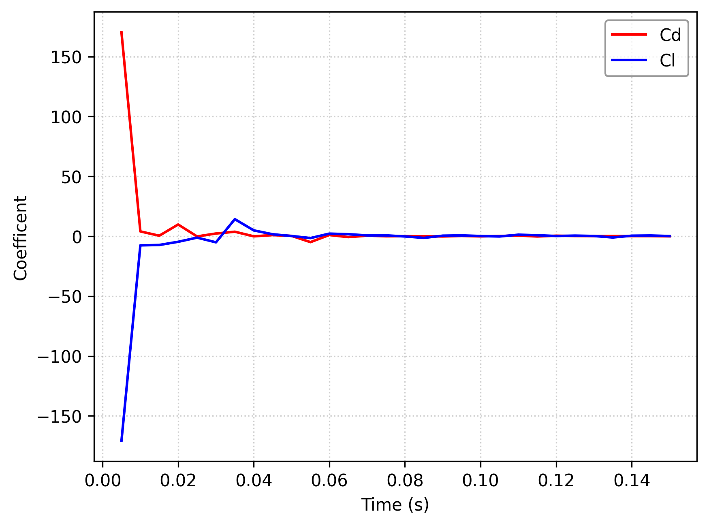
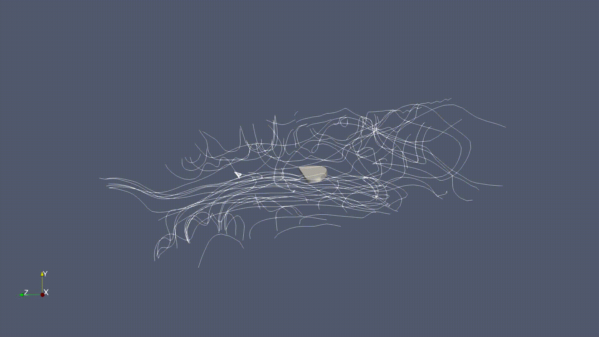

# High-Fidelity CFD Simulation of Dragonfly Forewing Aerodynamics

An advanced, transient computational fluid dynamics (CFD) study analyzing the high-lift generation mechanisms of a biomimetic dragonfly forewing. This project showcases proficiency in handling complex moving-boundary problems, low-Reynolds-number aerodynamics, and high-performance computing (HPC) workflows.

---

## 🛠️ Key Technical Competencies Demonstrated
* **Advanced CFD Solvers:** Expert implementation of `overPimpleDyMFoam` for moving bodies.
* **Complex Meshing:** Designed dual-domain grids utilizing **Overset Mesh (Chimera Grid)** techniques to eliminate mesh deformation errors during large-amplitude kinematics.
* **Transient Aerodynamics:** Captured highly non-linear, time-dependent fluid structures including Leading Edge Vortex (LEV) lifecycles and dynamic stall.
* **Cross-Platform Engineering Workflows:** Developed and executed the simulation within a Linux environment using **Windows Subsystem for Linux (WSL)** paired with **VS Code** remote containers.

---

## 🚀 Numerical Architecture & Solver Configuration

* **CFD Engine:** OpenFOAM v2512
* **Governing Equations:** Unsteady Incompressible Navier-Stokes
* **Mesh Methodology:** `blockMesh` background domain overlaid with a high-resolution component mesh wrapping the dragonfly wing geometry (`topoSet` & `oversetMeshBlended`).
* **Kinematics:** Implemented prescribed dynamic pitching and translation to mirror biological wing stroke frequencies.

---

## 🦋 Engineering Insights: The Physics of Insect Flight

Traditional steady-state aerodynamics fail at the low Reynolds numbers ($Re \approx 100 - 10,000$) typical of insect flight. This simulation successfully models the transient **Delayed Stall** mechanism used in biomimetic micro-aerial vehicles (MAVs):

1. **Vortex Generation (LEV):** As the wing translates at high angles of attack, a high-velocity fluid roll-up creates a massive Leading Edge Vortex.
2. **Low-Pressure Lift Core:** The center of this vortex acts as a low-velocity "dead zone," establishing an intense localized low-pressure field that generates the primary lift force.
3. **Spanwise Flow & Vortex Shedding:** The model accurately captures the three-dimensional spanwise velocity components that stabilize the vortex before it cyclically sheds into the wake during stroke turnaround.

### 📈 Aerodynamic Coefficients ($C_l$ & $C_d$) over Time
The force coefficients were extracted dynamically during runtime to evaluate the transient aerodynamic efficiency of the kinematics. The cyclical peaks correspond perfectly with the stroke frequencies and vortex-shedding intervals.

<p align="center">
  
</p>

---

## 📊 Data Visualization & Post-Processing (ParaView)

To rigorously analyze the transient vortex shedding lifecycle, a dual-pipeline visualization workflow was built in ParaView to separate boundary surfaces from the internal flow domain:

* **Wing Boundary Isolation:** Isolated the `wing` patch to evaluate solid-body surface interactions without internal volume obstruction.
* **Flow Field Tracking:** Deployed an optimized **Stream Tracer** pipeline mapped to the `internalMesh`. 
* **Velocity Profile Mapping:** Streamlines are colored by **U (Velocity Magnitude)** to visually contrast the high-velocity acceleration zone at the leading edge against the low-velocity vortex core.

### 🔄 Transient Vortex Shedding Lifecycle

| Mid-Stroke (LEV Peak) | Stroke Turnaround (Shedding) | Next Stroke Cycle (Re-formation) |
| :---: | :---: | :---: |
| Maximum lift generation; stable, tight vortex roll-up over the wing chord. | Kinematics change; the primary vortex detaches smoothly into the wake. | Flow re-attaches; an alternating vortex structure instantly develops. |

<p align="center">
  
</p>

---

---

## 🏃 HPC Automation & Workflow Execution

To optimize computational throughput on HPC clusters, the simulation pipeline is completely automated using modular **Bash scripting**. The repository includes an orchestration architecture that handles geometry preparation, meshing, and multi-core parallel processing execution cleanly.

### Automated Execution Sequence:
```bash
# 1. Clean environment, purge previous time directories, and clear cached data
./Allclean

# 2. Automated mesh generation (Background & Overset Component meshes)
./compileMesh

# 4. Execute the transient moving-mesh solver in parallel using MPI
./backgroundMesh/Allrun
